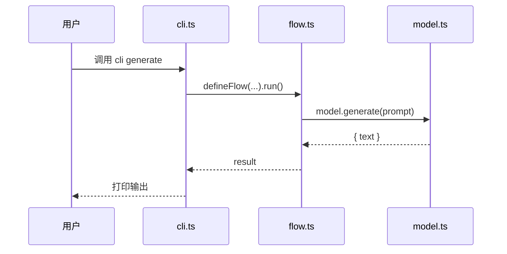
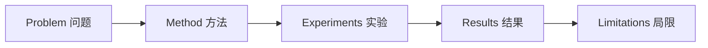

# 分析手法（Recipes）

两条流水线：仓库分析 / 论文分析。每一步给出"做什么 + 用哪些工具 + 输出到哪一章"。

---

## 仓库分析（Repo Branch）

### 第 0 步：准备

| 操作 | 命令/工具 |
|---|---|
| GitHub URL → 本地 | `git clone --depth 1 <url> /tmp/learn-ultra-<repo>` |
| 估算规模 | `find <repo> -type f \| wc -l` 和 `du -sh <repo>` |
| 主语言 | 看顶层 `package.json` / `pyproject.toml` / `go.mod` / `Cargo.toml` / `pom.xml` 之一 |

> **大型仓库（> 500 文件 或 > 50 MB）**：明确告知用户「这是大型仓库，我会按 README 索引重点深入，不会读完所有文件」。把 README 当地图，不要硬扫。

### 第 1 步：结构鸟瞰 → 章节 4 的素材

```bash
ls -la <repo>                        # 顶层
cat <repo>/README.md | head -200      # 项目自我介绍
```

按顶层目录写一个 markdown 表，回答"每个目录是干嘛的"：

| 目录 | 作用 | 重要度 |
|---|---|---|
| `src/` | 主代码 | ⭐⭐⭐ |
| `docs/` | 文档 | ⭐ |
| ... | ... | ... |

### 第 2 步：入口识别 → 章节 7 起点

找入口的 4 种线索：

1. `package.json` 里的 `"main"` / `"bin"` / `"exports"`
2. `pyproject.toml` 里的 `[project.scripts]`
3. README "快速开始" 章节里的第一个代码块
4. 文件名常见模式：`main.*` / `index.*` / `cli.*` / `server.*` / `app.*`

把找到的入口文件路径列出来，章节 7 的 sequenceDiagram 就从这里出发。

### 第 3 步：核心抽象提取 → 章节 5

**目标**：找出 3-7 个"理解了它就理解了一半项目"的核心抽象。

工具组合：

```bash
# 数声明数量
grep -rE "^(export )?(class|function|const|interface|type) " <repo>/src --include="*.ts" -h | head -40
grep -rE "^(class|def) " <repo>/src --include="*.py" -h | head -40

# 找文档里被反复提的概念名词
grep -oE "\b[A-Z][A-Za-z]{3,}\b" <repo>/README.md | sort | uniq -c | sort -rn | head -20
```

每个抽象按章节 5 的逐条格式写：

```
### 5.N <抽象名>

**定义**：1 句话精确定义

**为什么需要它**：如果没有它会怎样

**它是怎么工作的**：2-4 句描述机制

**与其他概念的关系**：和哪些抽象协作/对比

**关键细节/边界条件**：容易忽略的实现细节

**源码定位**：path/to/file.ts:42
```

### 第 4 步：端到端 trace → 章节 7 的 Mermaid 图

挑一个 README 里出现的 happy-path（比如「调用 generate() 生成文本」），从入口一路跟到底层：

1. Read 入口文件
2. 找到关键调用，Read 那个文件
3. 重复 2-4 层，深度优先
4. 把这条链画成 Mermaid sequenceDiagram：



文字叙述配图，提一下"在第 N 步发生了什么有趣的事"。

### 第 5 步：模块间关系梳理 → 章节 4 的逐模块展开

按"先理解依赖再理解使用者"的顺序，对每个核心模块逐条展开：

| 字段 | 说明 |
|------|------|
| 模块名 | 对应目录或包名 |
| 一句话职责 | 这个模块"只做什么" |
| 对外接口 | 暴露的关键 API / 导出符号 |
| 依赖关系 | 它调用谁、被谁调用 |
| 内部结构 | 子文件/子模块的组织方式 |
| 设计决策 | 为什么这样划分？有什么权衡？ |

同时整理出章节 3 的素材：从 README、CHANGELOG、docs 中提取"为什么要做这个项目"、"之前方案的不足"。

---

## 论文分析（Paper Branch）

### 第 0 步：准备

| 输入 | 操作 |
|---|---|
| arXiv abs URL（`/abs/2501.xxxxx`） | 改成 `/pdf/2501.xxxxx.pdf` 或 `https://arxiv.org/html/2501.xxxxx` |
| PDF 本地/远程 | 用 Read 工具，分页读（每次最多 20 页） |
| Markdown / 已转好的稿 | 直接 Read |

> 对长论文（> 30 页）：先快速扫 Abstract / Conclusion / 主要图表说明（caption），再决定哪一节深读。

### 第 1 步：骨架解析 → 章节 4 的素材

抽出每个一级章节的核心 1-2 句，整理成：



或者按"输入 → pipeline → 输出"画 flowchart。

然后对每个阶段逐条展开（输入 → 核心处理 → 输出 → 与前后阶段的关系 → 关键设计选择）。

### 第 2 步：问题定位 → 章节 3

逐条回答以下问题（用中文，每问独立成段）：

1. **问题定义**：作者想解决什么具体问题？形式化定义是什么？
2. **为什么难**（逐条 2-4 个难点）：每个难点说明难在哪里、为什么直觉方法不行
3. **前人工作逐条评述**（3-6 条）：每条格式为「方法/论文 → 核心思路 → 贡献 → 局限/与本文的差异」
4. **本文的关键洞察**：用 1-2 句话提炼作者最核心的 insight

### 第 3 步：方法核心 → 章节 5、6

- **章节 5（核心抽象/观点逐条解析）**：把方法里出现的关键术语/记号/创新点列出来，每个按逐条格式：

  ```
  ### 5.N <概念名>

  **定义**：精确定义（含符号）

  **为什么需要它**：解决什么具体问题

  **它是怎么工作的**：机制描述

  **与其他概念的关系**：在 pipeline 中的位置、与其他概念的协作

  **关键细节/边界条件**：适用条件、退化情况

  **论文定位**：Section X.X / Eq. (N)
  ```

- **章节 6（关键公式 + 大白话）**：挑 1-3 个最关键的公式，按双栏：

```html
<div class="code-pair">
  <pre><code class="language-math">
Attention(Q,K,V) = softmax(QK^T / √d_k) · V
  </code></pre>
  <div class="explain">
    <p>这是说：用 Q 去和每个 K 算相似度，得到一组权重，再用这组权重对 V 做加权平均。</p>
    <p>除以 √d_k 是为了让相似度数值不会因维度变大而爆炸。</p>
    <p>softmax 把相似度变成"和为 1 的注意力分布"。</p>
  </div>
</div>
```

### 第 4 步：实验关键 → 章节 7

把"一个完整样本走过 pipeline"画成 flowchart，让读者看见输入到输出的每一步。

然后用一个表格把 3-5 个关键实验数字列出来：

| 实验 | 基线 | 本文 | 提升 | 数据集 |
|---|---|---|---|---|
| 主任务准确率 | 78.3% | 82.1% | +3.8 | XYZ |
| ... | ... | ... | ... | ... |

并指出：哪个**消融**最能反映"为什么有效"。

### 第 5 步：局限与延伸 → 章节 9 的素材

- 作者承认的局限：从 Limitations 节抄过来，每条用中文复述
- 你读完后能想到的延伸：≥ 2 条，每条说"如果换成 Y 场景，可能 Z"
- 参考文献中挑 5-10 篇最关键的，整理成「引用 → 与本文关系」表格

---

## 通用：什么时候 dispatch 子代理

只有满足以下条件，才考虑用子代理并行：

- 仓库 > 200 文件，需要并行扫多个子目录
- 论文 > 50 页 + 有大量参考文献需要并行读

否则**单 agent 顺序处理即可**——并行带来的 context 切换和合并成本，对一篇 learn-ultra 报告来说通常不划算。
